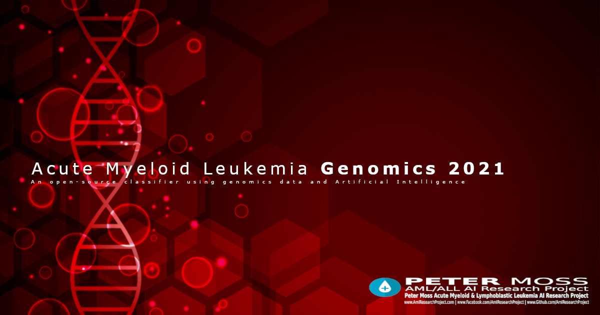

# Peter Moss Acute Myeloid & Lymphoblastic Leukemia AI Research Project
## Acute Myeloid Leukemia Genomics 2021

        

&nbsp;

# Table Of Contents

- [Introduction](#introduction)
- [DISCLAIMER](#disclaimer)
- [Getting Started](#getting-started)
- [Contributing](#contributing)
  - [Contributors](#contributors)
- [Versioning](#versioning)
- [License](#license)
- [Bugs/Issues](#bugs-issues)

&nbsp;

# Introduction
An Acute Myeloid Leukemia diagnostics project based on the research outlined in [Scalable Prediction of Acute Myeloid Leukemia Using High-Dimensional Machine Learning and Blood Transcriptomics](https://www.cell.com/iscience/pdf/S2589-0042(19)30525-5.pdf) by Stefanie WarnatHerresthal, Konstantinos Perrakis, Bernd Taschler, Torsten Haferlach, Sach Mukherjee & Joachim L. Schultze.

DEVELOPER TO EXPLAIN/UPDATE THE PROJECT DETAILS

&nbsp;

# DISCLAIMER

Theis project should be used for research purposes only. The purpose of the project is to show the potential of Artificial Intelligence for medical support systems such as diagnostics systems.

Although the classifier is accurate and shows good results both on paper and in real world testing, it is not meant to be an alternative to professional medical diagnosis.

Salvatore Raieli is a bioinformatician researcher and PhD in Immunology, but does not work in medical diagnosis.

Please use this system responsibly.

&nbsp;

# Getting Started

To get started follow the [getting started guide](docs/getting-started.md) to find out how to fork the repository.

&nbsp;

# Contributing

Asociación de Investigacion en Inteligencia Artificial Para la Leucemia Peter Moss encourages and welcomes code contributions, bug fixes and enhancements from the Github.

Please read the [CONTRIBUTING](CONTRIBUTING.md "CONTRIBUTING") document for a full guide to forking our repositories and submitting your pull requests. You will also find information about our code of conduct on this page.

## Contributors

- [Salvatore Raieli](https://www.leukemiaairesearch.com/association/volunteers/salvatore-raieli  "Salvatore Raieli") - [Asociacion De Investigation En Inteligencia Artificial Para La Leucemia Peter Moss](https://www.leukemiaresearchassociation.ai "Asociacion De Investigation En Inteligencia Artificial Para La Leucemia Peter Moss") Research & Development (Bioinformatics & Immunology), Bologna, Italy

&nbsp;

# Versioning

We use SemVer for versioning.

&nbsp;

# License

This project is licensed under the **MIT License** - see the [LICENSE](LICENSE.md "LICENSE") file for details.

&nbsp;

# Bugs/Issues

We use the [repo issues](issues "repo issues") to track bugs and general requests related to using this project. See [CONTRIBUTING](CONTRIBUTING.md "CONTRIBUTING") for more info on how to submit bugs, feature requests and proposals.